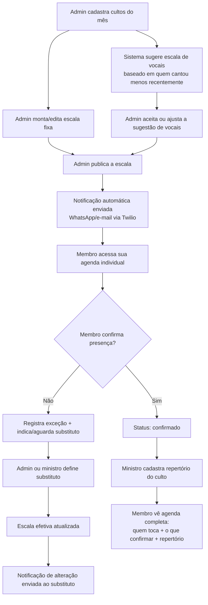

# Especificação — Sistema de Escalas de Louvor

Documento produzido na Fase 0 do [TASKS.md](../TASKS.md). Define papéis, permissões
e o fluxo principal do sistema antes de qualquer modelagem de banco ou código.

---

## 1. Papéis de usuário

### `admin`
Responsável geral do ministério (líder de louvor / coordenação).

**Pode:**
- Cadastrar, editar e inativar membros
- Cadastrar e editar a escala fixa (instrumentistas/ministros por dia da semana)
- Gerar e ajustar a escala de vocais (aceitar ou sobrescrever a sugestão automática)
- Registrar exceções e substituições
- Cadastrar cultos e repertório
- Publicar a escala (disparando notificações)
- Ver a agenda de qualquer membro

**Não pode:**
- N/A — é o papel com acesso total

---

### `ministro`
Conduz o culto; normalmente também tem função na escala fixa.

**Pode:**
- Ver a escala completa (todos os membros, não só a própria)
- Cadastrar/editar repertório dos cultos que conduz
- Registrar exceções/substituições para a própria escala fixa
- Confirmar ou recusar a própria presença

**Não pode:**
- Cadastrar/editar/inativar membros
- Alterar a escala fixa de outros membros
- Gerar ou sobrescrever a escala de vocais

---

### `vocal`
Participa do grupo rotativo de vocais.

**Pode:**
- Ver a própria agenda (próximos cultos em que está escalado)
- Confirmar ou recusar presença quando escalado
- Ver o repertório dos cultos em que participa

**Não pode:**
- Ver a escala de outros membros
- Alterar a escala de vocais (só o admin gera/ajusta)
- Cadastrar cultos, repertório ou membros

---

### `membro`
Instrumentista com escala fixa, sem função de vocal.

**Pode:**
- Ver a própria agenda (escala fixa + exceções que o afetam)
- Confirmar ou recusar presença
- Ver o repertório dos cultos em que participa

**Não pode:**
- Ver a escala de outros membros
- Alterar qualquer escala
- Cadastrar cultos, repertório ou membros

---

### Resumo de permissões

| Ação | admin | ministro | vocal | membro |
|---|---|---|---|---|
| CRUD de membros | ✅ | ❌ | ❌ | ❌ |
| CRUD de escala fixa (própria) | ✅ | ✅ (só a própria) | ❌ | ✅ (só a própria) |
| CRUD de escala fixa (de outros) | ✅ | ❌ | ❌ | ❌ |
| Gerar/ajustar escala de vocais | ✅ | ❌ | ❌ | ❌ |
| Registrar exceção/substituição | ✅ | ✅ (própria) | ❌ | ✅ (própria) |
| CRUD de repertório | ✅ | ✅ | ❌ | ❌ |
| Confirmar própria presença | ✅ | ✅ | ✅ | ✅ |
| Ver agenda própria | ✅ | ✅ | ✅ | ✅ |
| Ver agenda de todos | ✅ | ✅ | ❌ | ❌ |
| Publicar escala (dispara notificação) | ✅ | ❌ | ❌ | ❌ |

> Isso ainda vai virar middleware de autorização na Fase 3 — por ora é só a regra
> de negócio escrita, sem nenhuma linha de código.

---

## 2. Fluxo principal: do nascimento da escala até o membro

### Descrição em texto do fluxo

1. **Criação da base do mês** — o admin cadastra os cultos (datas de quarta, sábado, domingo).
2. **Montagem da escala fixa** — o admin mantém/ajusta quem toca em qual dia da semana.
3. **Sugestão de vocais** — o sistema calcula, para cada culto, quem deveria cantar
   com base em quem cantou menos recentemente (rodízio balanceado).
4. **Curadoria humana** — o admin aceita a sugestão ou troca manualmente antes de publicar.
   O sistema nunca escala ninguém sozinho, só sugere.
5. **Publicação** — ao publicar, o sistema dispara notificações (WhatsApp/e-mail) para
   todos os envolvidos naquele período.
6. **Visão individual** — cada membro, ao acessar, só vê a própria agenda (nunca a de outros,
   exceto admin/ministro).
7. **Confirmação de presença** — o membro confirma ou recusa. Recusar gera uma exceção.
8. **Substituição** — uma exceção pendente é resolvida por um substituto, definido
   por admin ou ministro. Isso atualiza a "escala efetiva" (a fixa + as exceções aplicadas).
9. **Repertório** — paralelamente, o repertório do culto é cadastrado e associado.
10. **Consulta final** — o membro vê, numa visão só, quem toca, o que precisa confirmar
    e o que será tocado.

---

## 3. Perguntas em aberto (a resolver conforme o projeto avança)

Estas ainda não têm resposta definitiva — cada uma deve ser decidida na fase
correspondente do [TASKS.md](../TASKS.md) e atualizada aqui depois:

- Um substituto pontual vira uma exceção permanente registrada, ou é só um "flag" temporário na visão efetiva daquela data? *(Fase 6)*
- A escala de vocais é gerada com que antecedência (semanal? mensal?) e pode ser regenerada depois de publicada? *(Fase 7)*
- O que acontece se ninguém confirmar presença até X dias antes do culto — existe lembrete automático? *(Fase 8 / Fase 10)*
- Um `ministro` também pode ser `vocal` no mesmo culto, ou os papéis são mutuamente exclusivos na prática do ministério? *(Fase 1, ao modelar `membros`)*
